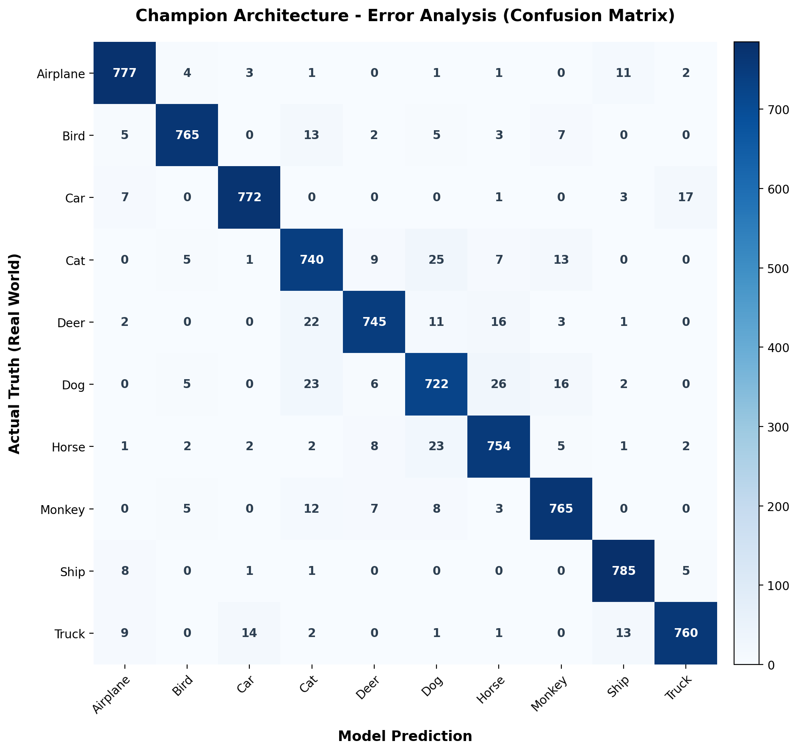
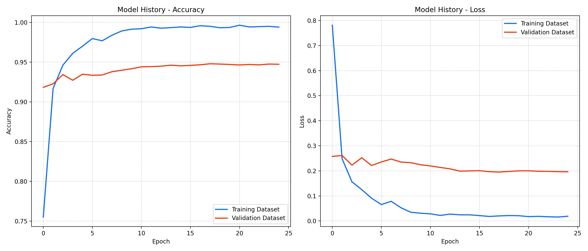
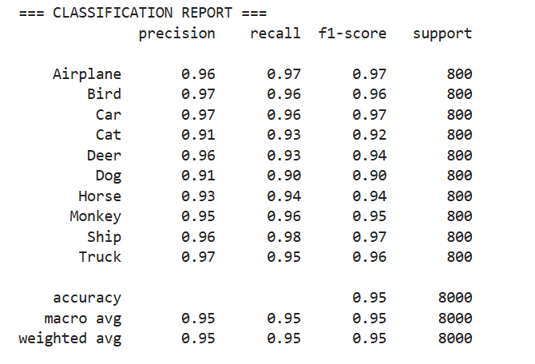

# 🚜 Edge-AI Vision: Low-Bandwidth Farm Security Classifier

[](https://huggingface.co/spaces/justwill19/classifier1/tree/main)

## 📌 The Business Problem
Agricultural security cameras operate in remote environments with highly constrained, low-bandwidth internet connections. Traditional cloud-based heavy vision models fail in these scenarios due to massive latency bottlenecks. Furthermore, subjects of interest (vehicles, animals, trespassers) are often out-of-center or partially obstructed, leading to false negatives in standard inference pipelines.

## 🛠️ The Solution (Multi-Stage Inference Architecture)
To solve these real-world constraints, this project implements a highly optimized, 3-Tier Escalation Architecture using a quantized **MobileNetV2** backbone trained on the STL-10 dataset. 

By locking the TensorFlow Lite interpreter to a single thread for cloud stability, the application cascades through inference stages to save compute power:
1. **The Fast Track (Full Frame):** Initial rapid assessment. If confidence is >99%, inference stops immediately, saving server cycles.
2. **OpenCV Smart Edge Crop:** If initial confidence is low, a mathematical Canny edge-detection crop isolates the subject from the background to remove noise.
3. **5-Zone Radar Scan:** If the subject remains ambiguous, the system physically sections the image into quadrants and a center-zone, running rapid sequential inference to catch off-center targets.

## 📊 Model Training & Telemetry 
* **Hardware Target:** Trained on NVIDIA A5500 (Duration: 8.35 minutes)
* **Framework:** TensorFlow/Keras -> Exported to `.tflite`
* **Performance:** Highly memory-optimized. Runs flawlessly on standard CPU-tier cloud instances.

### Diagnostics
*(Note: The following charts visualize the model's accuracy, loss, and class-specific precision over the validation dataset).*

| Confusion Matrix | Training Metrics |
| :---: | :---: |
|  |  |

<p align="center">
  
</p>

## 🚀 How to Run Locally

```bash
# 1. Clone the repository
git clone [https://github.com/wmeye19-cmd/edge-vision-classifier.git](https://github.com/wmeye19-cmd/edge-vision-classifier.git)
cd edge-vision-classifier

# 2. Install lightweight dependencies
pip install -r requirements.txt

# 3. Launch the Gradio Interface
python app.py